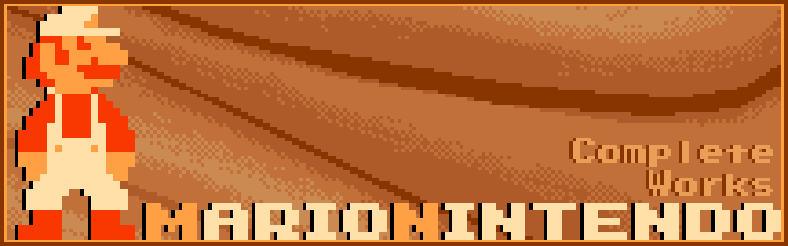
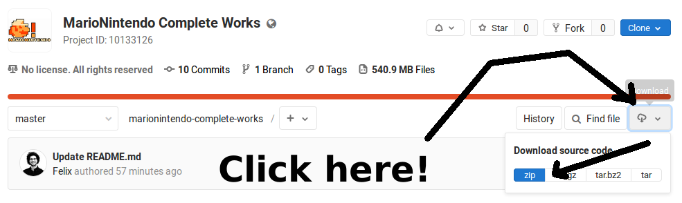
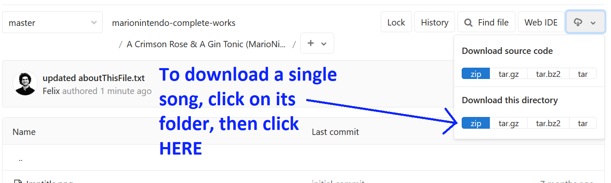
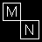
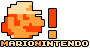

MarioNintendo Complete Works
============================

Thank you for downloading this pack. All of these charts have been created totally or in part
by me ([MarioNintendo](http://www.flashflashrevolution.com/profile/MarioNintendo/)), from 2008 to today. If you
have any questions or feedback, send me a PM or contact me on Discord (`@felleg`). It would make my
day!

If you are curious about a specific file, find the `aboutThisFile.txt` included in each song folder.

I hope you will enjoy the files and this preservation effort. :)

How to download this pack (or specific songs) from GitLab
=========================================================

Please visit https://gitlab.com/felleg/marionintendo-complete-works

<details><summary>Click for details</summary>
Scroll back to the top of this page, and click the download button:


Playing the pack with StepMania Online
--------------------------------------

**If you download the pack from GitLab, you will have to rename the pack folder from
`marionintendo-complete-works-master` to `MarioNintendo Complete Works` if you want to play it over StepMania
Online.**

Downloading individual songs
----------------------------

Don't want to download the full pack? Simply follow these steps:

</details>


Note about CD-titles
====================

You will generally find two CD titles in this pack. They are useful to distinguish my older files from my newer
files.

Original CD title
-----------------


This CD title is the original CD title I made for myself in Microsoft Paint, back in 2008.
If there's one thing you should notice, it's that even after all these years, I still use Paint for just about
everything.

I have used this CD title from 2008 to 2012. Its file name was `!udderTitle.png` because I had copied the file
structure from a file I had downloaded on the FFR Simfile Database (Udderdude's {Rose} Remastered). I had not
realized that "udder" in the filename referred to someone else's username, and so I lugged that CD title around
with no second thought! Pretty much no one knew about the existence of this CD title,
because I never submitted songs to public packs at the time. I made the songs available as downloads in the
description of my YouTube videos. At that time, I was mostly making simfiles for myself, since I did not know
how to get them accepted into the FFR R1 engine (see the song named Submission Rules). I am very nostalgic
towards these files, but even I will admit they are often bad and/or awkward. In 2012, ScylaX made me a new CD
title.

Current CD title
----------------


On September 24 2012, [ScylaX](http://flashflashrevolution.com/profile/ScylaX) rocked my world by creating a
brand new CD title for me. My request was the following:

```
How about a Super Mario 8-bit head with thin black outline
and my username right under it in small cool stylish blocky 8-bit outlined freecam100% text?

(I feel like I'm 12)
```

Even though my wording was garbage, ScylaX understood and managed to deliver pretty much exactly the CD title
I craved. I have been using this CD title ever since to identify my "modern" files. I consider my modern files
to start in Q4 2010, meaning everything created after (and including) `Nocturne Ab Min No 2`.

Song creation timeline
======================

To the best of my knowledge, here is the order in which I stepped my files. 

<details><summary>Expand list</summary>
<p>

```
  2008
========
(*) Winter
(*) {Rose} Remastered
(*) Loituma speedcore

  2009
========
(*) Candy Pop
(*) Mr Larpus
(*) Metropolis
Hell in 3 Seconds
The Time Warp
Jungle
(*) Tricky's Song
(*) FFReedom

  2010
========
Don't give a FUCK
(*) Nocturne Ab Min No 2
In Flux
(*) Spacefarer
Animus Intorqueo 1
Animus Intorqueo 2
Animus Intorqueo 3
Automata
Comfortably Lost
Stress

  2011
========
(*) Unf
botu1
Baby Still Too Fat
Love, The Elephant
(*) He's A Pirate
Mortal Kombat Metal Menu
spanish
Submission Rules
Lives Without Meaning
umad
I hate humans
Xanthystrauma

  2012
========
Never Enough
S
FF7 - Theme of Aeris
ULTRAnumb
Pictures at an Exhibition
Redirected Moonlight
shes got moxie
lookoutthewindow
.357 Magnum
Art of the Madness
Mario Mix for Piano
Jazzman - Super Mario Bros.
Pokemon BW - Elite Four
Mega Man 9 Rock Medley
Unshakeable
Car select
A Crimson Rose and a Gin Tonic

  2013
========
-Slapstick-
Felix^3
Accelerator
PWRPFF RAVES
La fuite des jours
(*) Heaven's Gate

  2014
========
Frainbreeze
(*) O Canada
(*) Wheelpower & Go
(*) Spinal Fluid Explosion Girl
(*) Space Threat
Shovel Knight Main Theme
Magical Sound Shower

  2015
========
(*) Moon Trance
(*) Entre l'ombre et la lumiere
(*) Fghjukiolkijhngbfvrgthyujikolkijuhgbfvrtgyhujioikj
Drive of Unliving Things
Mario Paint Medley
Ground Theme - Underground Theme

  2016 (most of these songs were included in VGMP4)
========
January
-------
	Chelnov Theme
February
--------
	The Void of Space
	A Beautiful Day For Golf
March
-----
	Hope & Joy Peace & Love
	DARK DEMON'S SONG
	Gear Getaway
	Balloon Fight Medley
April
-----
	The Mysterious Murasame Castle
May
---
	Black Rain
	Coeur de Ceramique
	Staff Credits (Mario Kart 7)
	You're IZAYOI
June
----
	City
	Kingdom of Devotindos
	Blue Field & Catch'em Theme
	Alien Lair
	Blade's Theme
	TAKE OFF
	Sortie
	Inner Goldfield
	Ending Theme
	Life Flashing Before One's Eyes
	Cursed Destiny
	Underwater
	Gerudo Valley
	Temple
September (after the VGMP4 release)
-----------------------------------
	(*) Megalovania
Also ...
--------
	(*) Hardwired
	Area A
	12-gauge pez dispenser

  2017
========
Boss Battle
Beep Beep I'm a Sheep
I've Got Rhythm

  2018
========
Tiger Rag
(*) Computer Blues
(*) Aleph-0

  2019
========
(*) Firewall

  2021
========
(*) Character Select - Super Mario Bros. 2 Extended

  2022
========
(*) Golf - Wario Land 3

  2023
========
(*) The Pizza Story
```

</details>

Note: `(*)` denotes a song that was previously unreleased.

Files not included in this pack
======================================

## Undertale Songs

I have created an Undertale troll pack which is downloadable [here](https://www.stepmania.com/forums/song-packs/show/5564) ([mirror](https://gitlab.com/felleg/undertale-pack)). The goal was to make fun of the tsunami of fan-content surrounding Undertale.  I still have tremendous love for the game: it really helped me get through 2015. However, I was not a fan of its fandom.

Interestingly, it is (by far) my most downloaded work: 47,000 downloads on MediaFire as of 2021/07/19. I don't get it.

In comparison, the "F8 Minipack of Doom" (of which all files are included in this Complete Works archive) has 618 downloads.
The Complete Works archive (which I poured my soul into) has 358 downloads.

Thus, because my Undertale troll pack is already my most downloaded work (and also a complete waste of time), I have chosen to leave it out of this archive.

<details><summary>Click here for the list of songs contained in the Undertale Pack</summary>
<p>

```
.
├── Chill (MarioNintendo)
├── Ghouliday (MarioNintendo)
├── Long Elevator (MarioNintendo)
├── Oh My (MarioNintendo)
├── Ooo (MarioNintendo)
├── Pathetic House (MarioNintendo)
├── She's Playing The Piano (MarioNintendo)
├── Small Shock (MarioNintendo)
├── Spooktune (MarioNintendo)
├── The Barrier (MarioNintendo)
└── You Idiot (MarioNintendo)
```
As you can see, pretty terrible selection (on purpose). :)
</details>

## Lost files

Here is a list of files that I have left incomplete or have tragically been lost over the years:

<details><summary>Expand list</summary>
<p>

```
900%MAX ANGERpower
Bring Back That Leroy Brown (This file from 2008 is lost, but the first 20 seconds were stepped. Circa 2009)
Circuit (Mario Kart 7 remix from Super Smash Bros. for Wii U)
Cities of the Future (Infected mushrooms, milla remix)
Diablosis Naga
Dwelling of Doom (Shnabubula)
Goodbye Yellow Brick Road (This file from 2008 is completely lost)
Magnum (xKore)
Manxome (Ryan Iyengar)
naTivefAce (playable in Dragons Fury engine, mostly stepped by Razor though)
PAC-MAN (Super Smash Bros. Wii U Version)
Reeps 2.0
steppin it up (Nick Perrin)
Super Mario Dirty Mix (A physician & A Scholar, never got permission for FFR)
```
</details>

Thanks
======

Thank you [Iggybuggydo](http://www.flashflashrevolution.com/profile/iggybuggydo) for the pack banner!
